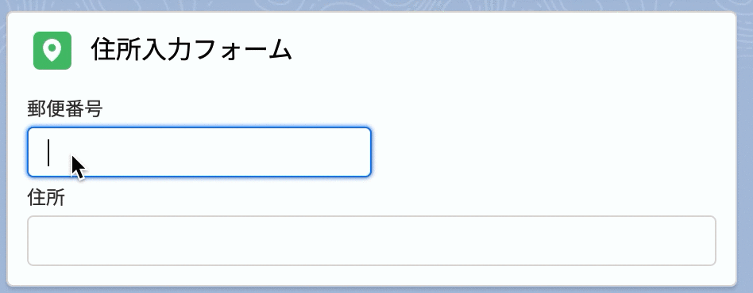

## 郵便番号から住所を自動入力する Lightning Web Component のサンプル

https://qiita.com/shunkosa/items/6ef87d8358b0f0788f3f



- [Yubinbango](https://github.com/yubinbango/yubinbango) の住所データを使用しています。

### コンポーネント一覧

- postalCode
  - 郵便番号の文字列を引数に取り、住所検索した結果をオブジェクトで返すサービスコンポーネント
- postalCodeExampleForm
  - Lightning アプリケーションビルダーで利用できる住所入力フォームのサンプル
- flowPostalCodeInput
  - Lightning フローで使用できる住所入力補助コンポーネント

### パッケージをインストールして試す

以下の URL からパッケージをイントールしてください。

- [Developer Edition / Trailhead Playground](https://login.salesforce.com/packaging/installPackage.apexp?p0=04tf4000004ToI6AAK)
- [Sandbox](https://test.salesforce.com/packaging/installPackage.apexp?p0=04tf4000004ToI6AAK)

### ソースコードをスクラッチ組織にデプロイして試す

1.リポジトリを clone します。

```
git clone https://github.com/shunkosa/lwc-jp-postcode-address-autocomplete.git
```

2. スクラッチ組織を作成します。

```
sfdx force:org:create -a postalcode -f config/project-scratch-def.json -s
```

3. ソースコードを push します。

```
sfdx force:source:push
```

4. スクラッチ組織をブラウザで開きます。

```
sfdx force:org:open
```
